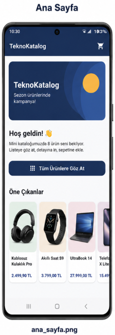
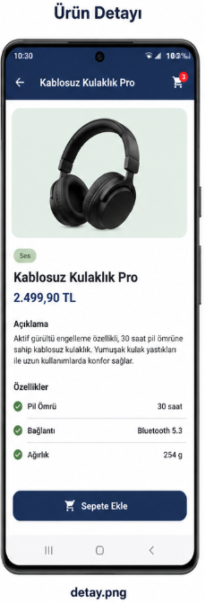
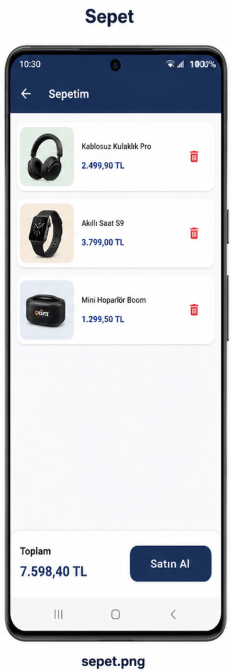

# 📱 Mini Katalog Uygulaması

Flutter haftalık eğitimi kapsamında geliştirilen ürün katalog uygulaması.
Ana sayfa → ürün listesi → ürün detayı akışı, sayfa geçişleri, JSON'dan veri
okuma ve basit sepet simülasyonu içerir.

## Ekran Görüntüleri

<!-- Uygulamayı emülatörde çalıştırıp ekran görüntülerini screenshots/ klasörüne kaydedin -->
| Ana Sayfa | Ürün Listesi | Ürün Detayı | Sepet |
|---|---|---|---|
|  |  |  |  |

## Kullanılan Flutter Sürümü

- **Flutter:** 3.24 ve üzeri (stable kanal)
- **Dart:** 3.5 ve üzeri
- Ekstra paket kullanılmamıştır; yalnızca `material.dart` (eğitim kapsamı gereği).

## Özellikler

- 🏠 **Ana sayfa:** Banner görseli ve öne çıkan ürünler (yatay `ListView.builder`)
- 🗂️ **Ürün listesi:** `GridView.builder` ile kart tabanlı tasarım, arama/filtreleme
- 📄 **Ürün detayı:** `Navigator.pushNamed` + **Route Arguments** ile ürün taşıma
- 🛒 **Sepet simülasyonu:** Sepete ekleme/çıkarma, rozet (Badge) ile adet gösterimi,
  `setState` ile basit state güncelleme
- 📦 **JSON simülasyonu:** Ürünler `assets/data/products.json` dosyasından
  `fromJson` ile model sınıfına dönüştürülerek okunur

## Proje Yapısı

```
lib/
├── main.dart                  # Uygulama girişi + Named Routes
├── models/
│   └── product.dart           # Product modeli (fromJson / toJson)
├── data/
│   ├── product_repository.dart# JSON'dan ürün yükleme
│   └── cart.dart              # Sepet simülasyonu
├── pages/
│   ├── home_page.dart         # Ana sayfa
│   ├── product_list_page.dart # GridView ürün listesi + arama
│   ├── product_detail_page.dart # Detay (Route Arguments)
│   └── cart_page.dart         # Sepet
└── widgets/
    └── product_card.dart      # Grid'de kullanılan ürün kartı

assets/
├── images/                    # Ürün ve banner görselleri
└── data/products.json         # Ürün verileri (API simülasyonu)
```

## Çalıştırma Adımları

```bash
# 1. Bu klasörün içinde platform dosyalarını üretin (android/, ios/ vb.)
flutter create .

# 2. Bağımlılıkları indirin
flutter pub get

# 3. Emülatörü veya fiziksel cihazı bağlayıp çalıştırın
flutter run
```

> Not: `flutter create .` komutu mevcut lib/, assets/ ve pubspec.yaml dosyalarına
> dokunmaz; yalnızca eksik platform klasörlerini üretir.

## Not

Ürün verileri ve görseller eğitim/demo amaçlıdır; gerçek bir e-ticaret
altyapısını temsil etmez.
